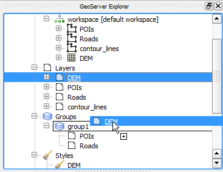

.. (c) 2016 Boundless, http://boundlessgeo.com
   This code is licensed under the GPL 2.0 license.

.. _actions:

Available commands and actions
===============================

This document contains a listing of available actions in the GeoServer Explorer.

Context menu actions
*********************

Below you can find more detailed information about commands available depending on the type of element you click onto in the GeoServer Explorer, and a more detailed explanation about how to use them.

This is a detailed  list of actions available for each item under the *GeoServer* branch.

- GeoServer Catalog item.

	- *Clean (remove unused elements)*. Cleans all styles in the catalog that are not used by any layer, and all stores that are not published through any layer.

	- *Remove*. Removes the catalog from the list of connected ones. This also removes it from the list that is kept between sessions, so it will not appear the next time that QGIS is started and the GeoServer Explorer is run.

	- *Publish layers to this catalog*. Shows the layers publishing dialog:

		.. image:: img/actions/publish_layers.png
			:align: center

		Select the *Publish* check box for each layer that you want to publish from the ones currently in your QGIS project. Then select the workspace into which each layer has to be imported and the name of the layer in the GeoServer catalog. By default, the name of the layer in the QGIs project is used, but that name might not be a valid XML name, and in that case it will appear in read and you will have to enter a valid name.

	- *Publish project to this catalog*. Publishes all the layers in the project. The publish operation is configured through the following dialog.

		.. image:: img/actions/publish_project.png 
			:align: center

		All layers will be published to the selected workspace. 

		If there are groups in the QGIS project, they will also be created. Groups are not overwritten when publishing a project. If a group with the same name exists in the catalog, a warning message will be shown and the group will not be uploaded.

		If you want to create a group containing all the published layers, enter its name in the *Global group name* textbox. Otherwise, leave it empty and the global group will not be created.

- GeoServer workspaces item.

	- *New workspace...*. Adds a new workspace.

	- *Clean (remove unused stores)*. Removes all data stores that are not published through any layer in the catalog.

- GeoServer workspace item.

	- *Set as default workspace*. Sets this workspace as the default one.

- GeoServer layer item.

	- *Add layer to QGIS project*. Similar to the *Add to QGIS project* command for feature types or coverages, but it also uses the style information in the case of vector layers. Style is downloaded as an SLD file and configured for the corresponding QGIS layer. In the case of raster layers, there is no support for SLD styles, and for this reason the layer will use a default style.

	- *Delete* Deletes the layer from the catalog. The associated style will be deleted if it is not used by any other layer and the corresponding configuration parameter is set. Another configuration parameter can be set to automatically delete the underlying data store when a layer is deleted. See the :ref:`configuration` section to know more about how to set those parameters. If a GWC layer associated to this layer exists, it will also be deleted.

	- *Add style to layer*. Adds a new style to the layer from the list of available ones in the catalog. The style is selected from the dialog shown below

		.. image:: img/actions/add_style.png
			:align: center

		If the layer is under a layer group item, the available commands can be used to re--order layers in the group or remove them.

			.. image:: img/actions/order_in_group.png
				:align: center

- GeoServer layer group item.

	- *Edit...*. Layers in a group can be configured through the following dialog.

	.. image:: img/actions/define_group.png
		:align: center

- GeoServer styles item

	- *New style from QGIS layer*. Creates a new style in the GeoServer catalog, using the style of a QGIS layer. The QGIS layer to use and the name of the style to create in the GeoServer catalog are specified in the following dialog.

	.. image:: img/actions/new_style.png
		:align: center

	- *Clean (remove unused styles)*. Removes all styles that are not being used by any layer.

	- *Consolidate styles*. Searches for layers in the catalog that have different styles that correspond to the same simbology. This might happens when uploading layers with the same style, since each uploaded layer will have its own layer with the same name as the layer, and all of them will share the same SLD code. This command find those styles that represent the same symbology, and in the layers that use them, replaces the corresponding styles with the first style in the list of redundant ones. After the command has been run, only one style of those that are identical will be in use, while the remaining ones will not be used by any layer. Those unused styles are not removed, but calling the *Clean (remove unused styles)* command will remove then from the catalog.

- GeoServer style item.

	- *Edit...*. Opens the QGIS symbology editor to edit the style of the layer. Create your symbology and accept the dialog to close. This will cause the style to be updated. Notice that the QGIS interface for defining a symbology is used to edit a GeoServer style, but since the layer that uses the style is not available, some restrictions exist:

		If the style item is under a layer item, the Explorer will get the attribute names of the layer, so you can use them for defining your symbology rules. The min and max values of those attributes in the layer are, however, not available, so you will not be able to use them to define ranges or categories.

		If the style item is not under the layer item, the Explorer  will try to find out if the style is used by any layer, and will use that layer in case it can find it. If several layers are using a style, the first one of them will be used. If no layer is found (no layer is using that style), the style will be opened for editing, but no field names will be available. You will be editing the style as if it corresponded to a QGIS layer with no attributes.

		Labeling is not supported in this case when fetching the SLD style to edit. That means that you can add labeling to the style you define, and it will get correctly uploaded to the catalog, but if the style you are editing has some kind of labeling defined, it will not appear on the QGIS style editor, which will always has labeling disabled.

		Editing a style using the QGIS symbology editor is only supported for vector styles. If you try to edit a raster style this way, the Explorer will show a warning message telling you that those styles cannot be edited.

	- *Edit SLD...* option. By clicking on it you can directly edit the content of the corresponding SLD, using a dialog with an XML editor, such as the one shown below.

		.. image:: img/actions/editsld.png
			:align: center

		Clicking on *OK* will update the corresponding SLD body in the catalog, with the current text of the editor. No validation is performed on the client side, but if the content of the editor is not a valid SLD, GeoServer will refuse to update it. The corresponding error message returned by GeoServer will be shown in the QGIS message bar.

		If the style is under a layer item, the following additional options are available.

			- *Set as default style*. Sets the style as the default style for the layer.

			- *Add style to layer*. A style can be selected in the dialog that will be shown, and it will be added as an additional style for the layer.

			- *Remove style from layer*. Removes a style from the list of alternatives styles of the layer. Not enabled for the default style of the layer. 		

- Settings item. The *Settings* item contains no children. Instead, when you click on it, it will display all configurable parameters in the description panel. You can edit them there and then press the *Save* button to upload changes to the corresponding catalog and update it.

GeoWebCache
-------------

- GeoWebCache layers

	- *New GWC layer...*. Adds a new GWC layer from an existing layer in the GeoServer catalog. The properties of the cached layer are defined in a dialog like the one shown below.

	.. image:: img/actions/define_gwc.png
		:align: center

- GeoWebCache layer.

	- *Delete*. Removes the cached layer

	- *Edit...*. Allows to change the properties of the GWC layer, by opening the same dialog used to define them when creating the layer.

	- *Seed...*. Launches a seeding operation for the cached layer. The operation is defined through the following dialog.

		.. image:: img/actions/seed.png
			:align: center

		The area to seed has to be entered in the box in the bottom part of the dialog, with a string of 4 comma-separated values (xmin, xmax, ymin, ymax). If no values are entered, the full extent of the layer to seed is used.

		Another way of setting the seeding region is to click on the *Define on canvas* button on the right--hand side of the extent box. This will cause the dialog to temporarily this appear and show the QGIS canvas. Just click and drag on the canvas to define the desired seeding region, and the dialog will show up again, containing the coordinates of the region.

		.. image:: img/actions/extent_drag.png
			:align: center

	- *Empty*. Deletes (truncates) all cached data for a given layer.

		When a seeding operation is started, the description box corresponding to the GWC layer being seeded will show the current state of the operation. 

		.. image:: img/actions/seed_status.png
			:align: center

		Since this operations might be very long, depending on the selected zoom levels and the area covered by the layer, progress in this case is not shown using the normal progress bar and hourglass mouse pointer. 

		Instead, you can use QGIS as usual while the operation is running in the background, and to update the status, just click on the *update* link in the description box to get the current number of processed tiles. If you want to stop the seeding operation, just click on the *kill* link.

Multiple selection
*******************

You can select multiple elements of the same type (i.e. multiple layers), to automate operations. For instance, you can create a new group with a set of selected layers. Just select a set of layers, right--click on them and select *Create group...*. A new group will be created with those layers, using the default style of each of them. For a more fine-grained definition of the group, remember that you can use the *Create new group...* option in the *Groups* item

Double-clicking on tree items
******************************

Certain items respond to double-clicking. If the corresponding element can be edited, the edition can be started by double-clicking on it instead of using the corresponding context menu entry. For instance, double-clicking on a group item will open the dialog to define the layers that are included in that group.

Drag & drop operations
***********************

The Explorer tree supports drag & drop, and you can use it to relocate elements, add a style to a layer or edit the configuration of an element, among other tasks 

Below you can find more information about the operations that can be performed this way.

- Dragging a GeoServer layer item onto a GeoServer group element. It adds the layer to the group, using its default style.
- Dragging a GeoServer or style item onto a GeoServer layer. It adds the style to the list of alternative styles of the layer.
- Dragging a GeoServer layer item onto the *GeoWebCache layers* item of the same catalog. It will add the corresponding cached layer for the dragged layer.

Multiple elements can be selected and dragged, as long as they are of the same type.

You can also drag elements from outside of the GeoServer Explorer itself. For instance, you can open the QGIS browser, select some files with raster or vector data and drag and drop them into a GeoServer catalog element in the GeoServer Explorer. That will cause the data in those files to be imported into the corresponding database or catalog. Format conversion will be performed automatically if needed.

.. image:: img/actions/dragdrop_external.png
	:align: center

If the dragged files are not opened in the current QGIS project, no style will be uploaded along with them when publishing to a GeoServer catalog.

To upload a layer and its style, you can drag and drop an element in the QGIS Layers panel.

Also, elements from the explorer can be dropped onto the QGIS canvas. GeoServer layers can be dropped onto the QGIS canvas to add them to the project. The corresponding WFS/WCS layer will be created as in the case of using the *Add to QGIS project* menu option, already described. If a group element is dragged from the Explorer and into the canvas, a WMS layer corresponding to that layer group will be added to the project.

	