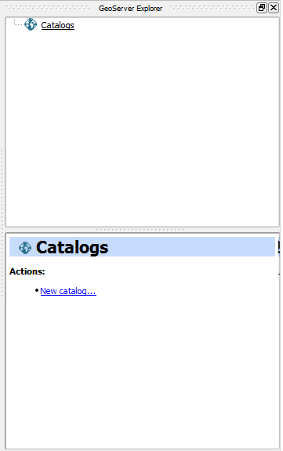
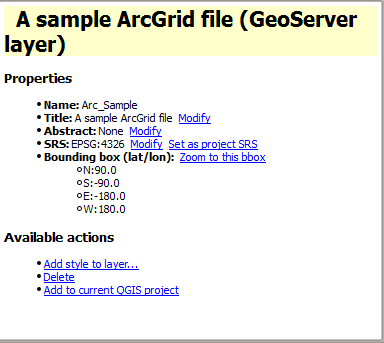
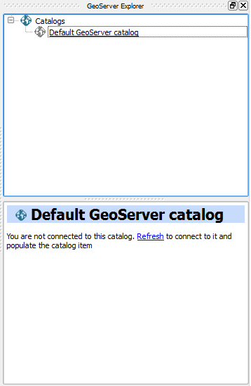
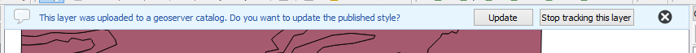

.. (c) 2016 Boundless, http://boundlessgeo.com
   This code is licensed under the GPL 2.0 license.

Usage
============

The GeoServer explorer is launched from the *Web/GeoServer* menu and it looks like this.

The *Catalogs* item contains the catalogs that you are connected to, and with which you can interact from the explorer. It is empty when you start the explorer, and you can add as many connections as you want to it.

GeoServer catalogs are defined using the *New catalog...* option in the *Catalogs* item. A catalog is defined using the following dialog:

.. image:: img/intro/add_catalog.png
  :align: center

Basic authentication is supported, as well as certificate-based authentication. Select the corresponding tab and enter the required parameters. The active tab in the window will define the type of authentication to use, even if the other tab has data in its text boxes.

In the lower part of the GeoServer Explorer window you will see a panel which shows the description of the currently selected item. When the explorer window is docked, the description panel is found on its lower the lower part. If you undock the window, it will be placed on the right--hand side of it, to make better use of the available space. The image below shows the undocked configuration.

.. figure:: img/intro/undocked.png
  :align: center

The description panel shows information about the currently selected element, but also contains links to actions that affect or are related to the current element. As an example, below you can see the description panel corresponding to a GeoServer layer element.

Use the hyperlinks to perform the corresponding actions based on the current element.

The description panel can also show tables where parameters can be edited. The one shown below corresponds to the *Settings* element of a GeoServer catalog.

.. figure:: img/intro/description_table.png
  :align: center

Most of the functionality of the explorer is accessed through context menus, right--clicking on the elements that form the Explorer tree. Also, when you select an element in the tree, buttons in the toolbar in the upper part of the explorer window are updated to show the available actions for that element. These actions correspond to the ones shown in the context menu when you right--click on the element, so you have different ways of accesing the same funcionality. As it was explained before, the *Description* panel is also interactive.

For a more complete reference, a detailed description of all the available actions for each type of element in the Explorer tree is available at the :ref:`actions` section.

.. _configuration:

Configuration
-------------

Along with the menu entry that starts the Explorer, you will find an entry that opens the configuration window, which looks as shown next.

.. figure:: img/intro/config.png
  :align: center

Use the parameters in this dialog to configure the Explorer to your particular needs. The properties that can be configured are described in detail below.

Keeping a list of previous GeoServer connections
------------------------------------------------

If you enable this option, whenever you connect to a catalog, the information that defines that connections is kept between sessions. Next time that you start QGIS and the GeoServer Explorer, you will see the catalogs item populated with all the previous connections, as shown in the next picture.

Retrieving information from each connection might take a long time and cause QGIS to take too long to start up. For this reason, catalog data is fetch on request and not automatically when starting the GeoServer Explorer. You should refresh the catalog item to populate it. Unpopulated catalogs are shown with a gray icon.

If the catalog uses basic authentication and username and password are introduced using the basic authentication tab, the password is not stored. You will be prompted to enter it when you reconnect to the catalog. If the *Configurations* tab is used, connection data (wheter password or certificate-based) will be stored in the encrypted QGIS auth database. You will be prompted to enter the master password in case you haven't used the auth database in the current QGIS session.

To delete a catalog from the list of previous connections, use the *Remove* option of the catalog item in the Explorer tree.

Automatically updating styles
------------------------------

If the corresponding property is enabled, the GeoServer Explorer plugin will take care of updating styles on the server whenever a layer that has been previously uploaded changes its simbology.

When a layer is uploaded to a GeoServer catalog, the plugin will start tracking it. If the simbology of a layer changes, you will see a message like the following one in the message bar.

Select *Update* to upload the new style. Click on *Stop tracking this layer* to avoid seeing more messages like that when the layer changes its simbology.

The style update works as well if the GeoServer Explorer is not open, or if the corresponding catalog is not active or not even listed in the Explorer tree.

Layer tracking is based on the source property of the layer (the filepath in the case of file-based layers), so renaming or moving the layer will deactivate the tracking mechanism for that layer. Layer tracking persist between QGIS sessions and is not linked to the QGIS project the layer might belong to.

Other parameters
----------------

* *Delete style when deleting layer*. If a GeoServer layer is deleted and is the only layer using a given style, the style will be also deleted if this parameters is checked

* *Delete resource when deleting layer*. If this parameter is checked, the resource that is part of a layer will also be deleted from its corresponding store if the layer is deleted.

* *Overwrite layers when uploading group*. When uploading a group, if this option is not enabled, the Explorer will try to reuse layers that already exist in the catalog. If a layer with the same name already exist, it will be used for the group, and the corresponding QGIS layer will not be uploaded. Check it if you want all layers to be imported, overwriting layers with the same name that might exist in the catalog.

Version support and limitations
----------------------------------

The current version of the plugin is targeted at GeoServer 2.3.x. or newer If you are using an older version, you might encounter some problems, and some elements might not be correctly configured due to differences in the way they are handled by GeoServer or in changes in the REST API that the plugin uses to communicate with GeoServer. Although most things should work fine if connecting to a GeoServer 2.2.x catalog, the following are some of the incompatibilities that have been detected.

* Empty groups. Layers belonging to a group are not found, since the group definition has a different structure
* Styles belonging to a given namespace are not found. Only styles with no namespace are reported if using GeoServer 2.2.x

To check the version of your catalog, just select the catalog in the tree and look at the description tab. 

.. figure:: img/intro/about.png
  :align: center

If you do not see information like that, it is likely that your catalog uses a GeoServer version that doesn't support that operation. In this case, you might find some issues when working with the catalog through the plugin.

When connecting to a catalog, the explorer tries to check the version. If it cannot detect the version or it cannot confirm it is the target version, it will ask you before adding the catalog.

.. figure:: img/intro/version_warning.png
  :align: center

Even if you are using the correct version of GeoServer, some limitations still exists. Below is a list of know limitations and issues than might appear.

* CRS. GeoServer might encounter problems when a custom CRS is used in QGIS. The CRS definition that works correctly when rendering the layer in QGIS might not work when importing the layer into GeoServer. Usually this results in a layer that is published but doesn't have a CRS set and is not enabled. You can correct that manually, selecting the layer in the Explorer tree and modifying its CRS.

  Notice that layers are imported using the SRS defined in the original data source (i.e., the ``prj`` file if using a shapefile). Setting a different CRS using the *Set Layer CRS* option in the QGIS TOC will not have any effect when importing the layer into GeoServer, unless you save the layer with that CRS and the CRS definition is stored along with the layer data.

* Layer names. The GeoServer Explorer uses the GeoServer REST API to get the list of layers in a catalog. The REST API describes layers without workspace, that meaning that if you have two layers with the same name and in different workspaces (for instance, ``ws1:mylayer`` and ``ws2:mylayer``), they will be shown as just one (``mylayer`` in this case).

  When this happens, the situation is ambiguous and GeoServer Explorer cannot differentiate between layers with the same name but belonging to different workspaces. The layer, as described by the REST API, is added to the Explorer tree, but it only represents one of the several layers that share the same name. To indicate this, the layer is shown with a warning icon, and a warning message is displayed in the layer description.

  .. figure:: img/intro/duplicated_layer.png
     :align: center

Another important limitation is due to the different versions of the SLD standard that QGIS and GeoServer support. Read the following section to know more about it.

Naming limitations
-------------------
GeoServer explorer has at the moment some known limitations when spaces and special chars are used in names for workspaces, stores, layers and symbology classes. The suggestion at the moment is to not use spaces or special chars when it comes to naming or symbology classes.

Styling limitations
-------------------

GeoServer explorer allows to edit the style of a GeoServer layer directly from the QGIS interface. It can convert a style defined in QGIS into a style to be uploaded to a GeoServer catalog, and use GeoServer styles for QGIS layers. This bidirectional conversion is, however, limited. This is mainly caused due to the different versions of the SLD standard that are supported by QGIS and GeoServer, and also to some limitations in both GeoServer and QGIS. SLD is used as the common format used by the GeoServer Explorer for describing styles in both QGIS and GeoServer layer, but some incompatibilities exist. To increase compatibility between them, specific routines have been added to the GeoServer explorer. However, in some cases, a style defined in QGIS might not be compatible with the elements supported by GeoServer, and publishing a layer will be done with a modified style, or even using a default one instead if that is not possible.

This problem exist even when using the most recent version of GeoServer, but older versions of GeoServer might show more incompatibilities and not validate a large part of the SLD produced by the GeoServer Explorer.

As a rule of thumb, basic styling for vector layers should work without problems in both direction, but more complex symbology might be partially or even completely incompatible, leading to differences between in, for example, the style that you define in QGIS and the style that the GeoServer layer will have. Raster layers have a more limited support

The following is a list of known limitations in SLD handling:

* Raster layers

  * Raster styling is supported only from QGIS to GeoServer. That means that a raster style can be created using the QGIS UI and uploaded to GeoServer, but a raster style from a GeoServer cannot be used for a QGIS layer. When a GeoServer layer is added to the current QGIS project using the GeoServer Explorer, it will use its symbology only if it is a vector layer, but will ignore it in the case of a raster layer and the default QGIS style will be used.

  * Only *Singleband Gray* and *Singleband pseudocolor* renderers are supported. In this last case, the *Exact* color interpolation is not supported, but *Linear* and *Discrete* modes are supported.

* Vector layers

  * When converting from a GeoServer style to a QGIS style, the style is always defined as a *Rule-based* style. That means that, even if the style is created using another type, such as *Graduated*, when it is uploaded to a GeoServer catalog and then edited again from QGIS, it will not appear as a *Graduated* style. This is due to how QGIS handles SLD styles, always interpreting them as symbology of type *Rule-based*. An example of this limitation is actually a consequence of an upstream QGIS issue (https://hub.qgis.org/issues/14170): *Graduated* or *Categorized* QGIS styles including a non-specific symbology class will be translated to an equivalent *Rule-based* where the rule representing the non-specific will miss an *ELSE* expression. This issue can be easily fixed by removing manually such symbology class, or adding to it manually the necessary *ELSE* expression.
  * Basic labeling is supported, but not all labeling will be exported from QGIS to SLD and uploaded to GeoServer. In particular, advanced data-dependent labelling is not supported.
  * Importing a point layer with a SVG style from QGIS to Geoserver results in a WMS layer that respects such SVG symbol. The same is not supported for now if the layer is re-imported as WFS layer.
